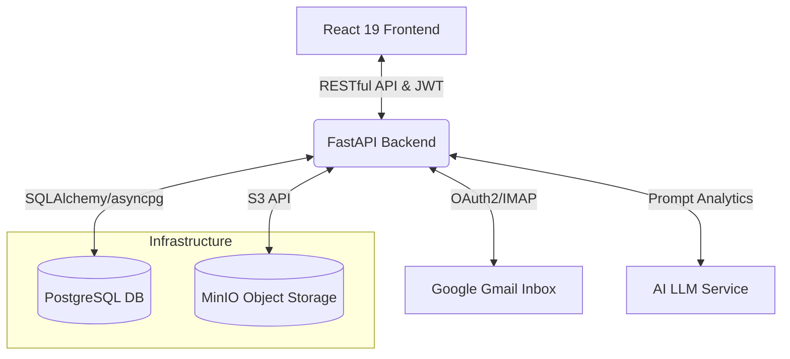

# Supplier Inventory Management Platform (供应商物料与库存管理平台)

[](https://reactjs.org/)
[](https://fastapi.tiangolo.com/)
[](https://www.postgresql.org/)
[](https://min.io/)
[](https://www.docker.com/)

**Supplier Inventory Management Platform** 是一个专为 PMC（生产物料控制）及供应链相关人员打造的高效、现代化的库存可视化与自动流转平台。系统借助极简的设计语言和清晰的信息架构，不仅实现了实时 BOM 状态跟踪、交料缺口分析与产能总览，还创新性地整合了 AI 能力，以自动化处理繁复的物料跟踪需求。

---

## 🌟 核心业务模块 (Core Modules)

系统基于角色访问控制 (RBAC) 划分了不同供应链上下游的主要工作流，提供各角色专属的业务视图：

- **👨‍💻 系统管理后台 (Admin Dashboard)**
  - 账户生命周期与权限分配管理。
  - 供应商信息统筹，支持通过解析 Excel 等表格批量导入供应商数据和基础物料分类；提供完整的操作审计日志 (Audit Logs) 查阅功能。

- **📦 供应商门户 (Supplier Portal)**
  - 供外部供应商登入的独立业务端，直接同步对应的采购订单 (Purchase Orders) 和交料需求。
  - 规范化文件提交流程，支持供应商针对物料在线上传合规报告（如 MSDS、RoHS、REACH、承认书及进料检验报告）。

- **🛡️ IQC 品控台 (IQC Review)**
  - 面向品质检验岗位的工作界面，针对供应商提交的技术图纸及送检报告建立核验流程 (Approve / Reject)。
  - 在系统中把控进料合规性，阻拦资料不全或未达标的物料流入后续环节。

- **🏭 PMC 控制面板 (PMC Dashboard)**
  - 提供生产相关的多维业务视图：包含库存实时盘点看板 (Inventory Stock Panel)、交单缺口预警 (Target Gap) 以及产能推演面板 (Capacity Panel)。
  - 搭载基于料号 (Part Number) 和描述的历史检索功能，溯源 BOM 结构变动与库存出入明细。
  - 支持 Gmail OAuth 邮件流接入，通过集成大语言模型分析往来邮件，自动抽取出交期回调或库存异动并生成入库调度建议。

## 🔐 安全架构与存储 (Security & Storage)

- **鉴权体系与私有化存储**: 采用无状态的 JWT 处理会话校验。内部集成并使用自托管的 MinIO (S3 兼容) 对象存储服务，实现供应商各类认证文件、产品图纸的私有化独立容灾存储。
- **前端交互与工程化**: 基于 React 19 标准与 Tailwind CSS v4 构建。系统沿用统一的高密度交互规范，规避了大量重复的表单样式，保证数据高频录入时的操作效率与响应稳定性。

## ⚙️ 核心架构及工作流 (Architecture)



## 📁 目录结构 (Structure)

本专案采用明确的逻辑划分：

- `/frontend`: 基于 Vite 的现代 Web 构建环境。包含了完备的 React 组件抽象体系、定制化的全局样式，以及核心视图如 (App.tsx / PMCView 等)。
- `/backend`: Python FastAPI 应用核心。封装了系统鉴权、基于 Pydantic 的校验、包含 Excel 解析和供应商初始化等独立服务脚本 (Scripts) 及其关联的定时监控任务 (Tasks)。
- `/postgres_data` / `/minio_data`: 依附于宿主机的基础设施卷挂载目录，旨在独立保障数据库及媒体文件的持久性。

## 🚀 启动与部署 (Getting Started)

借助 Docker Compose 容器编排协议，系统可以极其简便地在任意平台上实现微服务的快速上线和相互通信。

### 1. 前置依赖
- **Docker** 以及 **Docker Compose** 插件
- *(可选)* 若希望在宿主机深度开发及排错，建议配置 Node.js 及 Python (>=3.10) 基础环境。

### 2. 启动服务集群
克隆代码库并定位至根目录后，执行以下命令，该指令将拉取底层镜像库并协同完成前后端各模块构建：

```bash
docker-compose up -d --build
```
> *(在此之前，您可以依据 `.env.example` 对所需的秘钥信息进行相应填充。)*

### 3. 可视化访问
待服务群顺利度过健康度检查后，您可以通过下述标准路径访问不同子面：
- **操作后台主客端**：`http://localhost:3009` (取决于在 Compose 所下发的 FRONTEND_PORT)
- **后端接口说明页**：`http://localhost:8001/docs` (挂载的 Swagger 生成集)
- **云端存储管理**：`http://localhost:9001` (使用初始化信息登入面板) 
